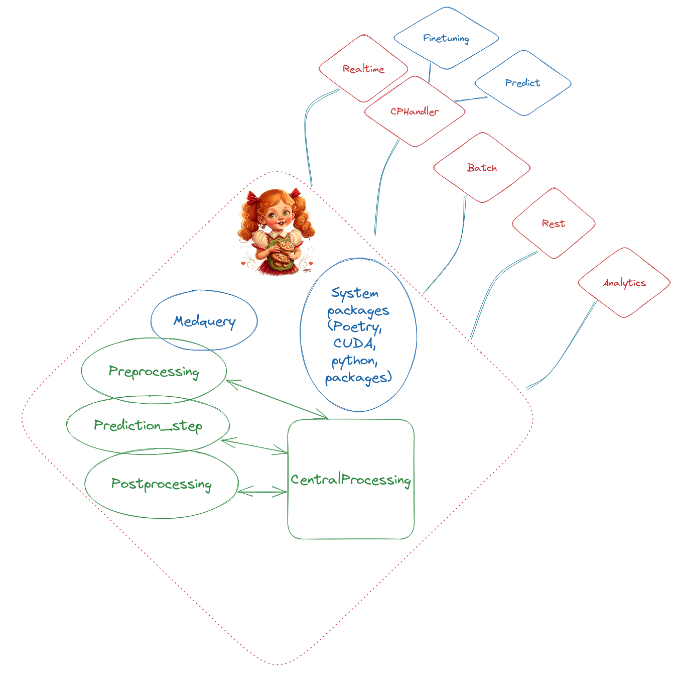

# Introduction

Hello, my name is Gingerbread, and I am a template enabling researchers to better engage with NeoMedSys. I’ll do my best to walk you through the steps involved in creating a new project and utilizing the template.

When you are ready to begin, click the **Next** button below.




# The philosophy
The project’s guiding principle is to give researchers a straightforward framework that is simple to utilize.

This framework includes built-in MedQuery certifications, eliminating the need to manually add them for every project.

The framework also has the usual packages like poetry, CUDA etc. installed, so you can start working on your project right away.

The framework is also designed to be easily extensible, so you can add your own packages and certifications as you see fit, which in turn will modulerize into the production pipeline.

Another aspect of the framework is that it is easier to have a common understanding of how it all operates both for experiments and in production through regular documentation and code updates.

The idea is also for researchers to add issues in the Github repository if there is any changes they would like to see in the framework, so that the framework can be improved over time and if there are any bugs or limitations.

<!-- 
# Tutorial Intro

Let's discover **Docusaurus in less than 5 minutes**.

## Getting Started

Get started by **creating a new site**.

Or **try Docusaurus immediately** with **[docusaurus.new](https://docusaurus.new)**.

### What you'll need

- [Node.js](https://nodejs.org/en/download/) version 16.14 or above:
  - When installing Node.js, you are recommended to check all checkboxes related to dependencies.

## Generate a new site

Generate a new Docusaurus site using the **classic template**.

The classic template will automatically be added to your project after you run the command:

```bash
npm init docusaurus@latest my-website classic
```

You can type this command into Command Prompt, Powershell, Terminal, or any other integrated terminal of your code editor.

The command also installs all necessary dependencies you need to run Docusaurus.

## Start your site

Run the development server:

```bash
cd my-website
npm run start
```

The `cd` command changes the directory you're working with. In order to work with your newly created Docusaurus site, you'll need to navigate the terminal there.

The `npm run start` command builds your website locally and serves it through a development server, ready for you to view at http://localhost:3000/.

Open `docs/intro.md` (this page) and edit some lines: the site **reloads automatically** and displays your changes. -->
